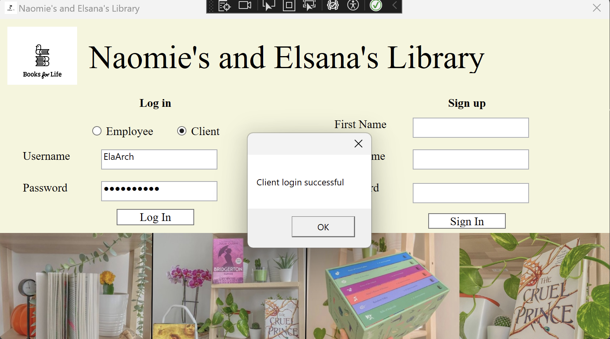
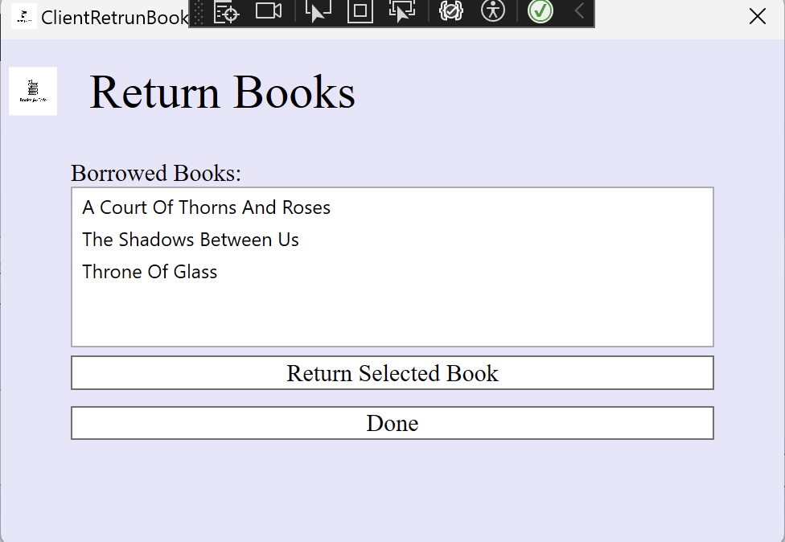

# Library Management System Application

**Project Period:** December 2023 – January 2024

**School:** John Abbott College

Go to demo: [Webpage Demo](#application-demonstration) (click here)

## Project Overview

The Library Management System Application developed for John Abbott College provides an intuitive interface for users to connect as either clients or employees. This system facilitates various functionalities such as borrowing and returning books, checking return deadlines, viewing overdue books, searching for books, accessing book and client information, adding new books, and managing employee data.

## Technologies Used

- **Development Environment:** Visual Studio
- **Programming Language:** C#
- **UI Framework:** Windows Presentation Foundation (WPF)
- **Version Control:** GitHub (Repository hosted on GitHub)

## Features

### For Clients
- **Borrow/Return Books:** Clients can easily borrow and return books through the application.
- **Check Return Deadlines:** The system allows clients to check the deadlines for returning borrowed books.
- **View Overdue Books:** Clients can view a list of books that are overdue for return.
- **Search for Books:** Clients have the option to search for specific books within the library.

### For Employees
- **Access Book Information:** Employees can access detailed information about books available in the library.
- **Access Client Information:** They can also view information related to clients registered with the library.
- **Add New Books:** Employees have the privilege to add new books to the library's collection.
- **Manage Employee Data:** The system provides functionality for managing employee data, ensuring efficient library operations.

## Development Environment

The application was developed using Visual Studio, leveraging the power of C# programming language for backend logic and Windows Presentation Foundation (WPF) for creating an interactive and user-friendly interface.

## Contributors:
- [Elsana Kanybek](https://www.linkedin.com/in/elsanakanybek/)
- [Naomie Edward](https://www.linkedin.com/in/naomieedward/)

## Application Demonstration

